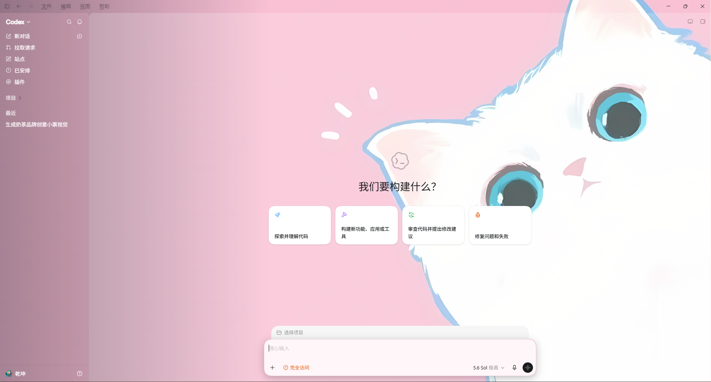
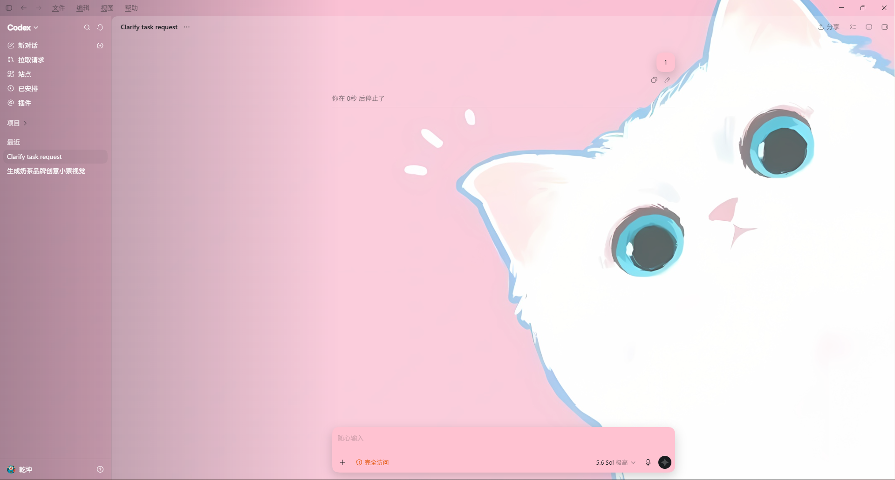
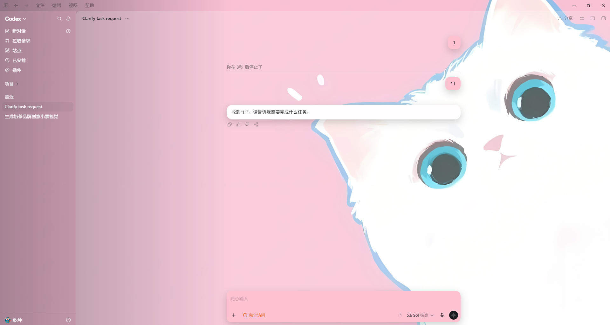

<p align="center">
  
</p>

<h1 align="center">CodexStyle</h1>

<p align="center">
  A local-first theme studio and managed launcher for OpenAI Codex Desktop on Windows.
</p>

<p align="center">
  <a href="https://github.com/Zhqiankun/codexDream/releases/latest"></a>
  <a href="LICENSE"></a>
  
  
</p>

<p align="center">
  <strong>English</strong> · <a href="README.zh-CN.md">简体中文</a>
</p>

CodexStyle lets you design, preview, save, import, and export visual themes for the Microsoft Store build of Codex Desktop. It applies a theme only to a Codex session launched and verified by CodexStyle, while leaving the installed Codex application untouched.

> [!IMPORTANT]
> CodexStyle is an independent community project. It is not affiliated with, endorsed by, or sponsored by OpenAI. Codex and OpenAI are trademarks of OpenAI.

## Screenshots

<p align="center">
  <a href="docs/viewImages/1a79b280-60db-4c51-86b9-afa3ee8ca0c6.png">
    
  </a>
</p>

<table>
  <tr>
    <td width="50%" align="center"><strong>Conversation workspace</strong></td>
    <td width="50%" align="center"><strong>Themed message surfaces</strong></td>
  </tr>
  <tr>
    <td><a href="docs/viewImages/dbb7011a-a20e-479a-bae4-45e79009a708.png"></a></td>
    <td><a href="docs/viewImages/ba92a3fc-046c-4ffc-932c-bfa1b472517d.png"></a></td>
  </tr>
</table>

## Highlights

- Live 16:9 previews for the Codex home and conversation views. Hover a configurable region to identify it, then click to open, scroll to, and focus its matching Studio control.
- Thirteen bundled wallpaper presets plus twenty-six independent colors, including selected conversation tabs, home titles/cards, command/edit/thinking summaries, message surfaces, and the surrounding workspace. Each of the four home suggestion cards can also use its own color or local image. Bundled presets are appended once and never overwrite an existing local theme.
- Validated background-image and custom-icon imports with clear size and format guidance.
- Local theme library with lossless current-theme ZIP export. Historical ten-, twelve-, and eighteen-color ZIPs remain importable, while the lossy legacy export option has been removed.
- Background-aware library thumbnails, with the next-launch theme control placed above the editor for quicker selection.
- Optional constrained Safe CSS for advanced styling.
- A dedicated Windows app icon, tray icon, and packaged application identity.
- Managed Codex launch on the theme-design page, with Store package detection, session isolation, CDP identity checks, and selector-profile compatibility checks.
- Local-first storage with a native Windows x64 secure-store component.
- User-initiated verified downloads for the installed Windows build, with progress, cancellation, restart-to-install, and install-on-exit choices. Background checks read only fixed release metadata; they never download or install silently.
- Privacy-bounded daily diagnostic logs with a 7-day retention window and a one-click **Open logs** action for troubleshooting.

## Download

Download `v1.3.10` from [GitHub Releases](https://github.com/Zhqiankun/codexDream/releases/latest):

- `CodexStyle-1.3.10-x64.exe` — guided Windows installer.
- `CodexStyle-1.3.10-x64.zip` — portable archive.
- `SHA256SUMS.txt` — SHA-256 checksums for the release and update artifacts.

The release is currently unsigned. Windows SmartScreen may show an unknown-publisher warning; verify the SHA-256 checksum before running the application.

`v1.3.10` fixes both responsive current-thread title surfaces and the separate home project/composer rail in Codex `26.825.4187.0`. It also adds click-to-locate Live Preview inspection and moves managed Codex launch into the theme-design page. Composer and user-message surfaces now consume the declared `panelAlt` color directly instead of reducing its opacity again. Install over the existing copy—no uninstall or computer restart is required; restart the managed Codex session after choosing the updated theme.

## Requirements

| Component        | Requirement                                                             |
| ---------------- | ----------------------------------------------------------------------- |
| Operating system | Windows 10/11 x64                                                       |
| Codex            | Microsoft Store package `OpenAI.Codex`                                  |
| Network          | Not required for theme editing; Codex itself may require network access |
| Permissions      | Standard user account; no administrator privileges required by default  |

## Getting started

1. Install or extract CodexStyle from the latest release.
2. Open **Theme Studio** and choose a preset or create a theme.
3. Adjust the colors, opacity, panels, background, message surfaces, and send icon while checking the live preview.
4. Save the theme and open **Codex Session**.
5. Close externally launched Codex windows, select the saved theme, and choose **Launch Codex**.

Use **Export theme ZIP** to preserve all current theme fields. An untouched imported formal package can be rebuilt with its original formal contents intact; editing it disables original-formal export. CodexStyle no longer creates lossy ZIPs for v1.0.x–v1.2.x clients.

CodexStyle verifies that the launched Store Codex session belongs to it before applying the selected theme. If the installed Codex build no longer matches the supported selector profile, CodexStyle stops at the compatibility boundary instead of injecting uncertain styles.

## Safety boundaries

CodexStyle is deliberately narrow in scope:

- It does not modify `WindowsApps`, `app.asar`, access-control lists, the official signature, or Windows execution policies.
- It does not take over, close, restart, or inject into Codex sessions launched outside CodexStyle.
- It applies themes at runtime only to an owned and verified session.
- It validates imported ZIP files, images, icons, and Safe CSS before storing or applying them.
- It performs no background update checks and includes no silent auto-installer or remote analytics service. GitHub is contacted only when the user chooses **Check and update**. Only an NSIS-installed build may download an update, and installation still requires an explicit user choice after SHA-512 verification.
- Managed data stays under `%LOCALAPPDATA%\CodexStyle` for the current Windows user.

See [PRIVACY.md](PRIVACY.md), [CODE_SIGNING_POLICY.md](CODE_SIGNING_POLICY.md), and [REQUIREMENTS.md](REQUIREMENTS.md) for the privacy, release-integrity, product, and security contracts.

## Development

### Toolchain

- Windows x64
- Node.js `22.22.0`
- npm `10.9.4`
- Visual Studio Build Tools 2019 or 2022 with the MSVC x64 C++ workload
- Windows SDK `10.0.19041.0` or later

### Setup

```powershell
git clone https://github.com/Zhqiankun/codexDream.git
cd codexDream
npm ci
npm run dev
```

### Verification

```powershell
npm run format:check
npm run lint
npm run typecheck
npm run test:unit
npm run test:renderer
npm run test:integration
npm run test:e2e
npm run architecture:check
```

`test:unit` builds the native secure-store from source. `test:e2e` prepares the locked Electron runtime, builds the app, and launches a real Electron shell against an isolated temporary local-data directory.

### Build Windows packages

```powershell
npm run package:win
npm run verify:package
```

Artifacts are written to `release/`. Packaging verifies the renderer and main-process resources, icons, Windows x64 executable, native addon architecture, and native addon loading.

Official binaries are built by the [Release workflow](.github/workflows/release.yml), not on a maintainer workstation. A stable `v*` tag runs the full verification suite on GitHub's Windows runner, builds the installer and portable ZIP, validates and publishes `latest.yml` plus the NSIS blockmap, regenerates `SHA256SUMS.txt`, preserves the workflow artifact, and publishes the matching GitHub Release. The channel manifest is uploaded last, and an already-public version is never overwritten.

## Project layout

```text
src/contracts/          Shared IPC and theme contracts
src/main/app/           Main-process application orchestration
src/main/domain/        Theme domain model
src/main/infra/         Local storage, ZIP, image, CSS, and native adapters
src/main/platform/      Windows Store and process integration
src/main/session/       Managed Codex session and theme injection
src/preload/            Narrow Electron preload bridge
src/renderer/           React Theme Studio and session UI
native/secure-store/    Windows x64 N-API secure-store source
tests/                  Unit, renderer, acceptance, and Electron E2E tests
```

Additional project documents:

- [REQUIREMENTS.md](REQUIREMENTS.md) — product contract and acceptance criteria.
- [PLAN.md](PLAN.md) — architecture and delivery plan.
- [TASK_PROGRESS.md](TASK_PROGRESS.md) — implementation and verification history.
- [PRIVACY.md](PRIVACY.md) — local data and network behavior.
- [CODE_SIGNING_POLICY.md](CODE_SIGNING_POLICY.md) — release-signing roles and policy.

## Contributing

Issues and pull requests are welcome. Keep changes within the documented trust boundary, preserve the one-way module dependencies, and include tests for behavior changes. Run the verification commands relevant to your change before opening a pull request.

## License

CodexStyle is released under the [MIT License](LICENSE).
